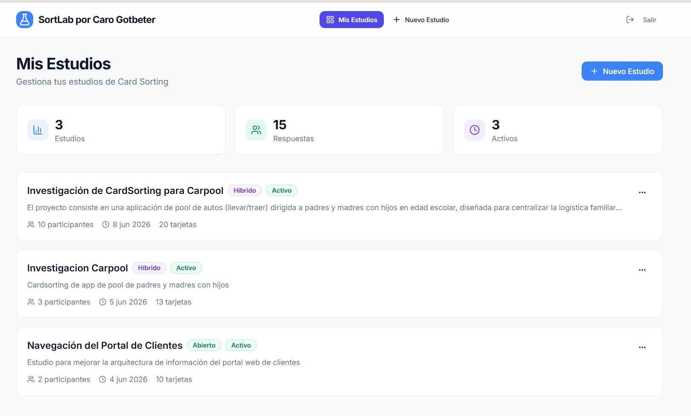
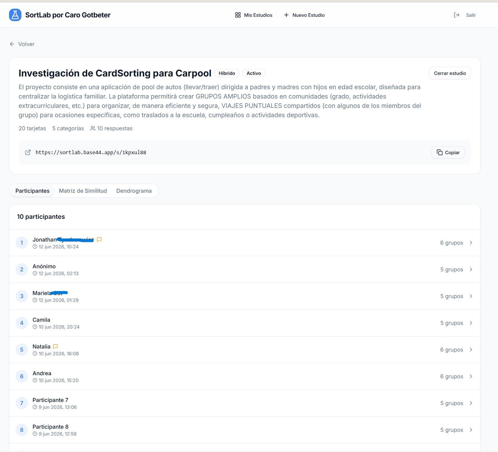
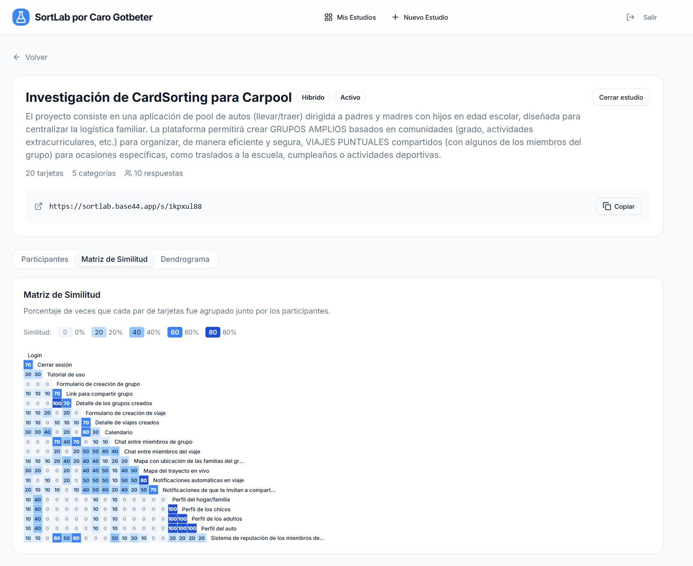
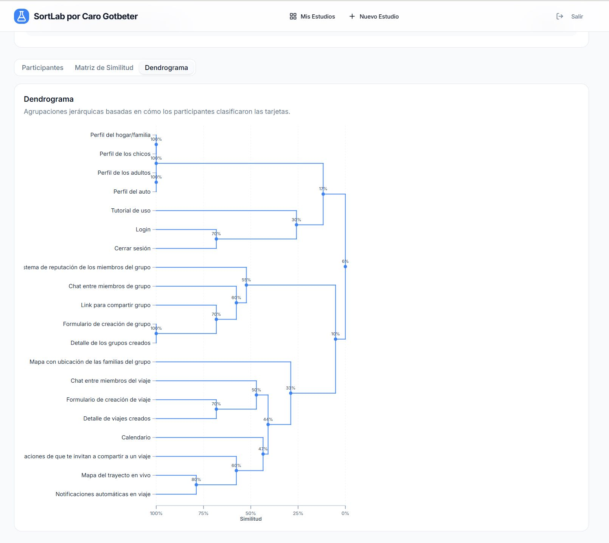
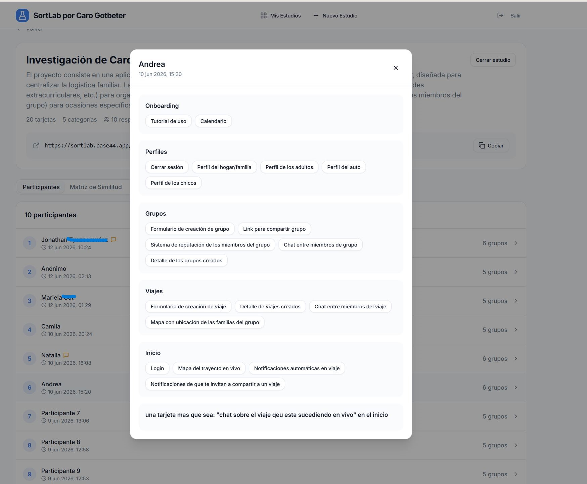
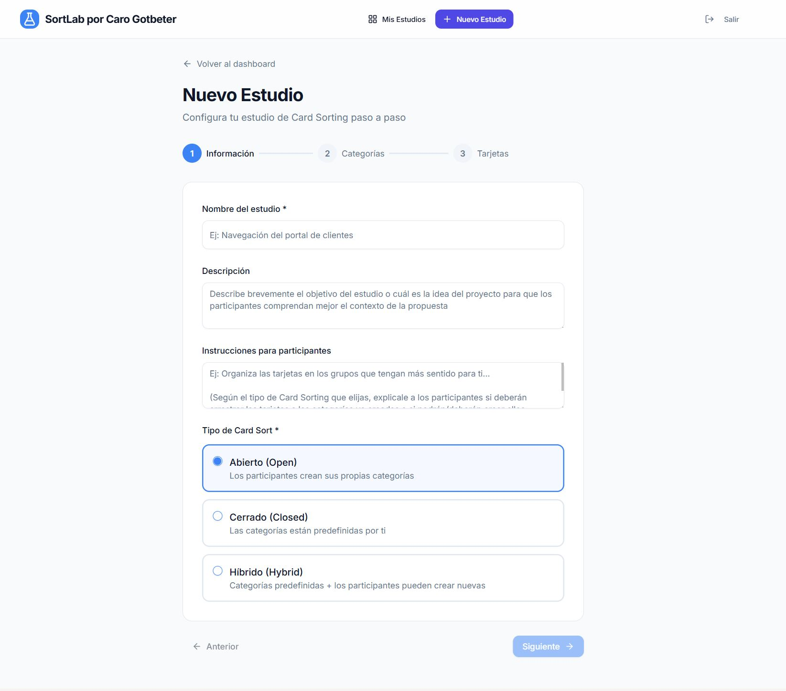
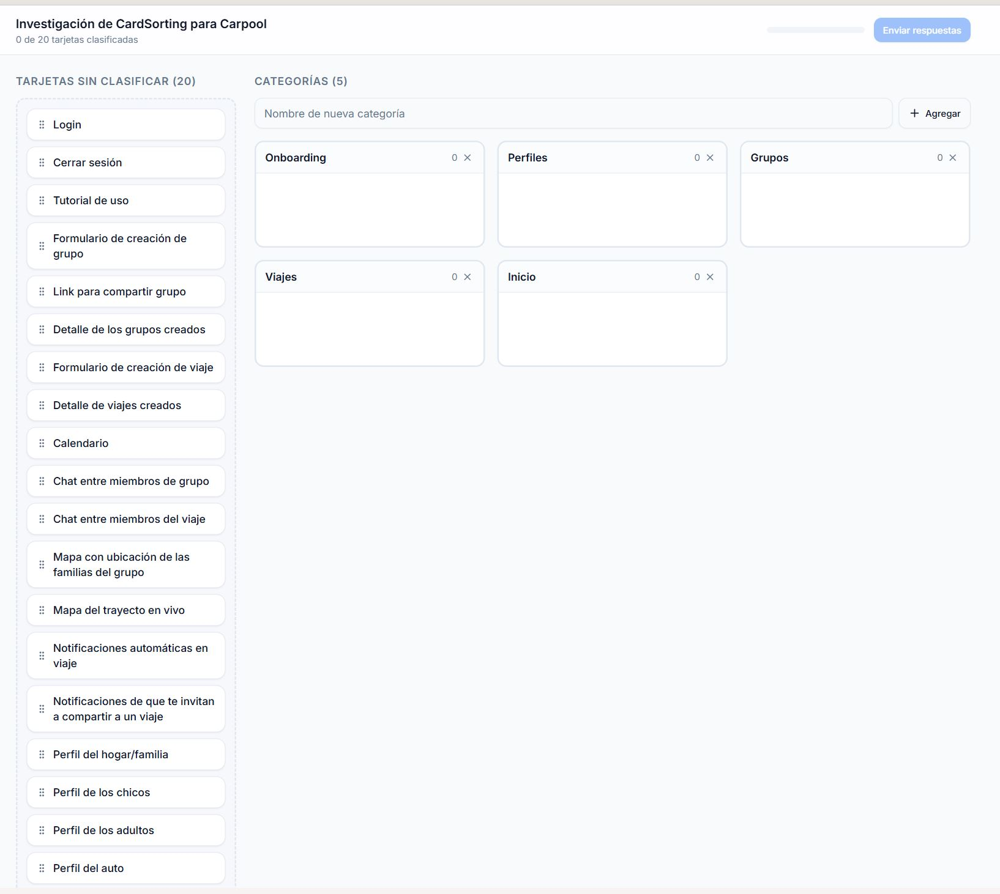

# SortLab

## Live Demo

https://sortlab.base44.app/

SortLab is a web-based platform for conducting remote Card Sorting studies. Built to democratize UX research, it removes common industry barriers such as expensive subscriptions, participant limits, card restrictions, and category caps.

The platform helps UX researchers, information architects, designers, and students organize content structures, validate navigation systems, and gather actionable insights directly from users.

---

## ✨ Features

### Unlimited Flexibility
- Unlimited cards
- Unlimited categories
- Unlimited participants
- No subscription tiers or hidden restrictions

### Remote-First Research
- Share studies with participants anywhere
- No installation required
- Responsive experience across devices

### Automated Analysis
- Real-time aggregation of participant responses
- Instant visualization of results
- Export-ready findings for research reports

### Visual Insights
Generate professional visualizations that support information architecture and UX decision-making.

---

## 📊 Data Visualization

### Similarity Matrix

A heatmap showing how frequently participants grouped cards together. This helps identify strong associations and potential content relationships.

### Dendrogram

A hierarchical clustering diagram that reveals patterns in participant groupings and helps define navigation structures and content categories.

### Results Dashboard

Analyze participant behavior and review generated insights from completed studies.

---

## 📸 User Flow

### 1. Create a Study
Set up a new card sorting exercise from your dashboard.

### 2. Configure Cards and Categories
Define your content items and optionally create predefined categories.

### 3. Invite Participants
Share the study link and collect responses remotely.

### 4. Analyze Results
Review similarity matrices, dendrograms, and participant groupings.

---

## 🛠️ Tech Stack

- **Frontend:** React, Vite, Tailwind CSS
- **UI Components:** Radix UI
- **Backend & Infrastructure:** Base44
- **Drag & Drop:** @hello-pangea/dnd

---

## 🎯 Why SortLab?

Many existing card sorting platforms restrict researchers through participant limits, card quotas, or premium subscription requirements.

SortLab was created as a free and accessible alternative that enables researchers, students, and independent professionals to conduct complete card sorting studies without artificial limitations.

The goal is simple: make Information Architecture research accessible to everyone.

---

## 👩‍💻 Author

Developed by **Carolina Gotbeter** as part of her UX Research and Frontend Development portfolio.

GitHub: https://github.com/Carolagot